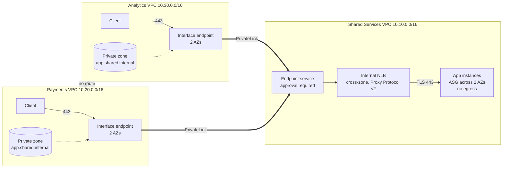

# AWS PrivateLink Multi-VPC Architecture in Terraform

[](https://github.com/MoYusuf1/aws-privatelink-multi-vpc-terraform/actions/workflows/terraform.yml)

The safest way to let two teams share a service is to never connect their networks.

This project models a fintech environment with three isolated VPCs. Payments handles transactions, Analytics runs reporting, and Shared Services hosts an internal application both teams need. Each consumer reaches that application privately through AWS PrivateLink. There is no VPC peering, no transit gateway, no internet gateway, and no public IP anywhere in the design, and neither consumer can reach the other.

For a company, this means a new team can be given access to a shared service with one reviewed approval instead of new routes, and the audit scope around sensitive environments like Payments does not grow every time another team is onboarded.

## Background

I first built this architecture by hand in the AWS console and wrote about the design choices in [How I Built a Private Multi-VPC Architecture with AWS PrivateLink](https://www.linkedin.com/pulse/how-i-built-private-multi-vpc-architecture-aws-mohamed-yusuf-xjnoc/). It worked, but it only existed because I had clicked through the console in the right order, and nobody else could reproduce it.

This repository rebuilds it as Terraform so it can be reviewed, tested, and recreated with one command. It also includes the production improvements I listed at the end of that article: instances spread across Availability Zones, encryption in transit, narrower security group rules, flow logs and monitoring, private DNS, and a structure that is ready for separate AWS accounts.

## Architecture



A request from Payments resolves `app.shared.internal` to the interface endpoint inside the Payments VPC, crosses the AWS network to the endpoint service in Shared Services, and reaches the application through an internal Network Load Balancer. The load balancer adds a Proxy Protocol v2 header that carries the caller's endpoint ID, so the application knows which team made the request. Analytics follows the same path through its own endpoint. Nothing touches the public internet, and no route exists between any of the VPCs.

```
$ curl -sk https://app.shared.internal
shared-services app
served_by=i-0abc... (use1-az1)
caller_vpce=vpce-0payments...
```

The same request from Analytics returns a different `caller_vpce`.

## Design decisions

**PrivateLink instead of peering.** Peering connects networks, not services. Once two VPCs are peered, security groups become the only boundary, and every extra path is something an auditor eventually has to review. PrivateLink exposes one approved service and nothing else. The tradeoff is an hourly charge per endpoint that peering does not have. [Full write-up](docs/decisions/0001-privatelink-over-peering.md)

**Subnets placed by Availability Zone ID.** Zone names like us-east-1a map to different physical zones in different AWS accounts, and an interface endpoint can only use zones where the service is running. Every VPC is built from the same list of zone IDs so the provider and its consumers always line up, even across accounts. [Full write-up](docs/decisions/0002-subnets-by-az-id.md)

**Approval managed in code.** Shared Services keeps an allow list of accounts that may request a connection, and each connection still has to be accepted. Both steps live in Terraform, so onboarding a team is a pull request that adds one line, and revoking a team is removing it. The commit history becomes the audit trail. [Full write-up](docs/decisions/0003-approval-as-code.md)

**Caller identity and zero egress.** Proxy Protocol v2 lets the application see which endpoint each request came through. The application is a small Python service that uses only what ships with Amazon Linux, so nothing installs at boot and the application tier has no outbound rules at all. [Full write-up](docs/decisions/0004-proxy-protocol-and-zero-egress-app.md)

**Security group rules enforced on PrivateLink traffic.** The load balancer checks inbound rules against the consumer's private IP, which gives Shared Services a second gate after approval. That only works if consumer ranges never overlap, so a validation rejects overlapping VPC ranges before Terraform plans anything. [Full write-up](docs/decisions/0005-nlb-security-group-enforcement.md)

**Built for separate accounts.** Each team has its own Terraform provider. By default all three use the same credentials so the lab runs in one account. Setting a role ARN for each team deploys the same code across three accounts without any other change.

## Security and observability

- One named security group per workload. Consumers reach only their own endpoint, each endpoint accepts only its own team's clients, and the application accepts only the load balancer.
- The default security group in every VPC is stripped of all rules so nothing can fall back to it.
- TLS from the client to the application server, with the load balancer passing traffic through untouched.
- Instance metadata limited to IMDSv2 and encrypted EBS volumes on every instance.
- VPC flow logs on all three VPCs, so there is a record of what connected and when.
- A CloudWatch alarm when fewer healthy application instances are behind the load balancer than expected.
- Remote state in S3 with versioning, public access blocked, TLS required, and native lock files.
- CI authenticates to AWS through GitHub OIDC with a read-only role, so no long-lived keys are stored anywhere.

## Getting started

### Prerequisites

- Terraform 1.10 or newer
- AWS CLI v2 with credentials for one account, or three roles (see [`terraform.tfvars.example`](terraform.tfvars.example))

### Deploy

Create the remote state bucket once:

```bash
terraform -chdir=bootstrap init
terraform -chdir=bootstrap apply
terraform -chdir=bootstrap output -raw backend_hcl > backend.hcl
```

Then deploy the environment:

```bash
make init
make apply
```

### Verify

```bash
make output
```

This prints the commands to connect to each test client through EC2 Instance Connect, with the real instance IDs filled in. From each client, `curl -sk https://app.shared.internal` should return the caller's endpoint ID.

### Clean up

```bash
make destroy
```

The bootstrap stack only holds the state bucket and can be left in place for the next run.

## Testing and CI

The tests use Terraform's built-in test framework with mocked AWS providers, so they run in seconds without credentials or cost. They check that approval is required, Proxy Protocol v2 is enabled, the load balancer spans every Shared Services subnet, each security group admits only what it should, both consumers are explicitly accepted, overlapping ranges are rejected, and the test clients are optional.

```bash
make test
```

Every pull request runs formatting, validation, the tests, tflint, and a Checkov security scan through [GitHub Actions](.github/workflows/terraform.yml). When Checkov flags something that does not fit a lab, such as customer managed KMS keys or a full year of log retention, the exception sits next to the resource with a written reason. Once the OIDC role from the bootstrap stack is configured, the pipeline also posts a read-only plan on each pull request. It never applies.

## What broke along the way

The first CI run failed. Every Terraform test errored with messages like `"log_destination" is an invalid ARN` and `"launch_template.0.id" must begin with 'lt-'`, and Terraform reported mock resources left in state after the run.

The infrastructure code was fine. The problem was in the tests. Mock providers fill computed values such as ARNs and IDs with random strings, but the AWS provider still validates the format of any value that is passed into another resource. A random string flowing from a log group into a flow log, or from a launch template into an Auto Scaling group, failed that validation before any assertion ran. I gave the mocks realistic ARNs and IDs for the resources whose outputs feed other resources.

That fix exposed a second, quieter bug. Assertions that compared an output to a literal list, such as `output.az_ids == ["use1-az1", "use1-az2"]`, failed even though the values matched, because Terraform treats a list and a tuple literal as different types. Wrapping the expected values in `tolist()` fixed it.

The lesson was that a mocked test suite is still code that needs its own debugging, and that a green test only means something once it has been seen failing for the right reasons.

## Failure tests

[`docs/failure-tests.md`](docs/failure-tests.md) walks through four ways to break the environment on purpose once it is running:

1. Terminate an application instance and confirm the service keeps answering from the other Availability Zone while Auto Scaling replaces it.
2. Revoke Analytics and confirm Payments keeps working.
3. Turn Proxy Protocol off by hand and confirm that TCP health checks stay green while every request fails, then let `terraform plan` catch the drift.
4. Plan with overlapping address ranges and confirm validation stops the change before anything reaches AWS.

Day-two operations such as onboarding a new team, revoking access, and responding to the health alarm are covered in the [runbook](docs/runbook.md).

## Cost

Approximate us-east-1 on-demand prices at the time of writing:

| Resource | Per hour |
|---|---|
| 2 interface endpoints across 2 AZs | $0.040 |
| Network Load Balancer | $0.023 |
| 4 t3.micro instances (2 app, 2 test clients) | $0.042 |
| EBS, flow logs, alarm | under $0.01 |
| **Total** | **about $0.11** |

EC2 Instance Connect Endpoints are free, and a private hosted zone deleted within 12 hours of creation is not charged. PrivateLink costs more than peering, which has no hourly charge. The trade is a small recurring fee in exchange for never creating network reachability that has to be policed.

## Project structure

```
.
├── main.tf                   # networks, shared service, consumers, approvals
├── providers.tf              # one provider per team
├── variables.tf
├── outputs.tf
├── modules/
│   ├── network/              # isolated VPC, subnets by AZ ID, flow logs
│   ├── service-provider/     # NLB, Auto Scaling group, endpoint service, alarm
│   │   └── app/server.py     # HTTPS service that reads Proxy Protocol v2
│   └── service-consumer/     # interface endpoint, private DNS, test client
├── bootstrap/                # remote state bucket and GitHub OIDC role
├── tests/                    # mocked Terraform tests
└── docs/
    ├── decisions/            # architecture decision records
    ├── failure-tests.md
    └── runbook.md
```

## Limitations

- The approval step reads consumer endpoint IDs from modules in the same stack. In a real multi-team setup each team would own its own state, and approvals would come from a request process between stacks.
- The service certificate is self-signed, so the test clients use `curl -k`. Clients do not verify the server yet.
- Mocked tests prove the configuration says what I intended. They do not prove AWS behaves the way I expect, which is what the failure tests are for.
- Everything runs in one Region.

## What I would improve next

- Ship the application's request logs to CloudWatch through a CloudWatch Logs interface endpoint, keeping the no-internet design intact.
- Issue the service certificate from ACM Private CA so clients verify the service instead of trusting it.
- Deploy across three real AWS accounts and add a second Region using the same modules.
- Add a synthetic check that sends a real request through each endpoint, since a TCP health check cannot see application failures.

## License

[MIT](LICENSE)
