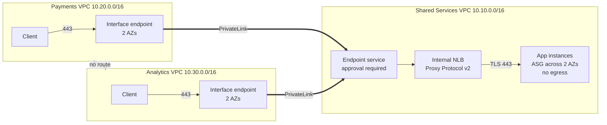

# AWS PrivateLink Multi-VPC Architecture in Terraform

[](https://github.com/MoYusuf1/aws-privatelink-multi-vpc-terraform/actions/workflows/terraform.yml)

Three isolated VPCs for a fintech scenario. Payments and Analytics both consume one internal application owned by Shared Services, privately over AWS PrivateLink. There is no peering, no transit gateway, no internet gateway, and no public IP anywhere, and neither consumer can reach the other.

I first built this by hand in the console ([write-up](https://www.linkedin.com/pulse/how-i-built-private-multi-vpc-architecture-aws-mohamed-yusuf-xjnoc/)). This repo rebuilds it so a team can review every access decision, test every change, and recreate the environment with one command ([write-up](https://www.linkedin.com/pulse/how-i-rebuilt-private-multi-vpc-architecture-so-team-could-yusuf-c21mf/)).

## Architecture



Each consumer calls `app.shared.internal`, which resolves to an endpoint in its own VPC. The NLB adds a Proxy Protocol v2 header carrying the caller's endpoint ID, so the application knows which team made each request.

## Design decisions

| Decision | Why |
|---|---|
| [PrivateLink over peering](docs/decisions/0001-privatelink-over-peering.md) | Exposes one service instead of connecting networks. Costs an hourly endpoint fee that peering does not. |
| [Subnets by AZ ID](docs/decisions/0002-subnets-by-az-id.md) | AZ names map to different physical zones per account. IDs keep provider and consumers aligned. |
| [Approval in code](docs/decisions/0003-approval-as-code.md) | Onboarding or revoking a team is a reviewed one-line change with history. |
| [Proxy Protocol v2, zero egress](docs/decisions/0004-proxy-protocol-and-zero-egress-app.md) | The app can attribute requests to a team, and has no outbound rules at all. |
| [NLB rules on PrivateLink traffic](docs/decisions/0005-nlb-security-group-enforcement.md) | A second gate after approval. A validation rejects overlapping VPC ranges so it stays reliable. |
| One provider per team | Runs in one account today. Setting a role ARN per team deploys to three accounts unchanged. |

Also in place: one security group per workload, emptied default security groups, TLS end to end, IMDSv2, encrypted volumes, flow logs on every VPC, a healthy host alarm, and CI access through GitHub OIDC with no stored keys.

## What broke along the way

The first CI run failed before any test ran, with errors like `"log_destination" is an invalid ARN`. The Terraform was fine. The mocked providers fill computed values with random strings, and the AWS provider still validates ARN and ID formats when those values feed other resources. I gave the mocks realistic values. That exposed a second bug: assertions comparing an output to a literal list failed because Terraform treats a list and a tuple as different types. Wrapping expected values in `tolist()` fixed it.

## Quick start

Requires Terraform 1.10+ and AWS credentials.

```bash
terraform -chdir=bootstrap init && terraform -chdir=bootstrap apply
terraform -chdir=bootstrap output -raw backend_hcl > backend.hcl

make init
make apply
make output     # commands to reach each test client and curl the service
make destroy
```

## Testing and CI

`make test` runs mocked Terraform tests with no credentials or cost. They assert that approval is required, callers are identified, each security group admits only what it should, both consumers are accepted, and overlapping ranges are rejected. Every pull request runs fmt, validate, tests, tflint, and Checkov. Checkov exceptions sit next to the resource with a written reason.

[Failure tests](docs/failure-tests.md) describe how to break the running environment on purpose, and the [runbook](docs/runbook.md) covers onboarding, revocation, and alarms.

## Cost and limitations

About $0.11 per hour in us-east-1, mostly endpoints, the NLB, and four t3.micro instances. Destroy it when you are done.

- Approvals read endpoint IDs from the same stack. Separate teams would need a request process between stacks.
- The certificate is self-signed, so test clients use `curl -k`.
- Mocked tests prove the configuration, not AWS behavior. The failure tests cover that.
- Single Region.

## Next steps

- Ship app logs to CloudWatch through a private endpoint.
- Issue the certificate from ACM Private CA.
- Deploy across three real accounts and a second Region.

## Author

**Mohamed Yusuf**, Cloud Engineer. AWS Certified Solutions Architect Associate.
[LinkedIn](https://www.linkedin.com/in/mohamed-yusuf1/) · [GitHub](https://github.com/MoYusuf1)

[MIT License](LICENSE)
